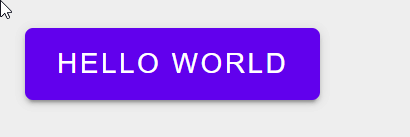

# Overview

[](https://lerna.js.org/)

The purpose of this project is to troubleshoot problems encountered when a `lit`-based package depends on a `LitElement@2.0.0`-based package **and** `@web/dev-server-storybook`

This branch is implemented as an "npm workspaces" monorepo containing a single package

| function                                                   | pass/fail |
| ---------------------------------------------------------- | --------- |
| demo via dev-server <br> `npm run start`                   | [ ] fail  |
| demo via storybook <br> `npm run storybook`                | [ ] fail  |
| demo static storybook site <br> `npm run storybook:static` | [ ] fail  |

## Failure Notes

Note that this branch produces failures in all demos above

**Expected Outcome** \_(record from another branch)


**Actual Outcome**



# Scripts

**Installing**

```
npm i
```

**Building**

```
npm run build
```

**Demo via `@web/dev-server`**

```
npm run start
```

**Demo via `@web/dev-server-storybook`**

```
npm run storybook
```

**Demo static storybook**

Demo the result of a storybook-build

```
# First build the storybook static site
npm run storybook:build

# Then serve it
npm run storybook:start
```

# Other Notes

```
$ npm -version
8.5.0
$ node --version
v16.14.2
```

## npm ls results

```
@acme/components@0.1.0
└─┬ @acme/x-foo@0.1.0 -> .\packages\x-foo
  ├─┬ @material/mwc-button@0.23.0
  │ ├─┬ @material/mwc-icon@0.23.0
  │ │ └─┬ lit-element@2.5.1
  │ │   └── lit-html@1.4.1
  │ ├─┬ @material/mwc-ripple@0.23.0
  │ │ ├─┬ @material/mwc-base@0.23.0
  │ │ │ └─┬ lit-element@2.5.1
  │ │ │   └── lit-html@1.4.1
  │ │ ├─┬ lit-element@2.5.1
  │ │ │ └── lit-html@1.4.1 deduped
  │ │ └── lit-html@1.4.1
  │ ├─┬ lit-element@2.5.1
  │ │ └── lit-html@1.4.1 deduped
  │ └── lit-html@1.4.1
  └─┬ lit@2.2.2
    ├─┬ lit-element@3.2.0
    │ └── lit-html@2.2.2 deduped
    └── lit-html@2.2.2
```

```
$ npm ls lit-element
@acme/components@0.1.0
└─┬ @acme/x-foo@0.1.0 -> .\packages\x-foo
  ├─┬ @material/mwc-button@0.23.0
  │ ├─┬ @material/mwc-icon@0.23.0
  │ │ └── lit-element@2.5.1
  │ ├─┬ @material/mwc-ripple@0.23.0
  │ │ ├─┬ @material/mwc-base@0.23.0
  │ │ │ └── lit-element@2.5.1
  │ │ └── lit-element@2.5.1
  │ └── lit-element@2.5.1
  └─┬ lit@2.2.2
    └── lit-element@3.2.0
```
